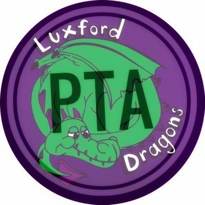

# Welcome to Luxford Elementary PTA

Welcome to the official website of the Luxford Elementary Parent Teacher Association! We're a dedicated group of parents, teachers, and community members working together to enhance the educational experience for all students at Luxford Elementary School.

## About Our PTA

The Luxford Elementary PTA is committed to fostering a strong partnership between families and our school. Through fundraising, volunteer efforts, and community building, we support our students, teachers, and educational programs.

**Our School:** Luxford Elementary School  
**Address:** 4808 Haygood Rd, Virginia Beach, VA 23455  
**Website:** [https://luxfordes.vbschools.com/](https://luxfordes.vbschools.com/)

## 🦕 Luxford Elementary PTA Board Members  
**2025–2026**

- **President:** Ashley Watkinson  
- **Vice President:** Katie Delfraisse  
- **Treasurer:** Jonathan Delfraisse  
- **Secretary:** Ashley Weidrick  
- **Volunteer Coordinator:** Alyssa Pentz  
- **Events Chair:** Ashley Threadgill

## Our Mission

To enhance the educational experience of every student at Luxford Elementary by:
- Supporting teachers and educational programs
- Building a strong school community
- Providing resources for student success
- Advocating for our children's needs
- Creating opportunities for family involvement

## Quick Links

- **[Get Involved](get-involved.md)** - Learn how you can help make a difference
- **[Events](events/list.md)** - See what's happening at our school
- **[Givebacks](givebacks.md)** - Join PTA membership & support through everyday purchases
- **[Documents](documents.md)** - Access important PTA documents and reports
- **[Contact Us](#contact-us)** - Reach out with questions or ideas

## Contact Us

**General Questions:** [luxfordpta1@gmail.com](mailto:luxfordpta1@gmail.com)  

---

*Thank you for being part of the Luxford Elementary community! Together, we're making a difference in our children's education.*
